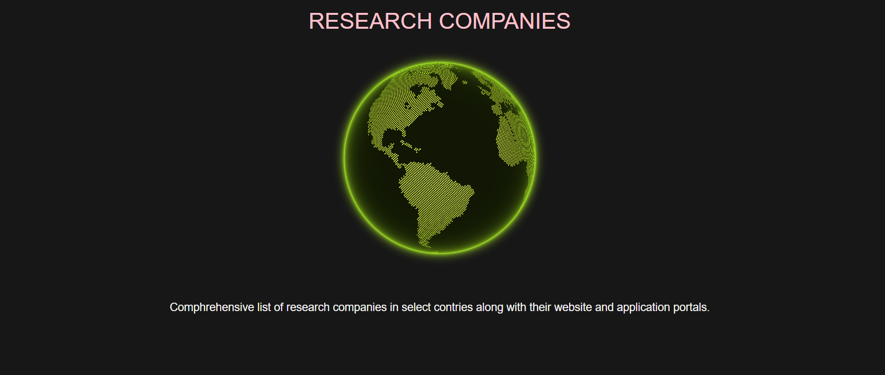
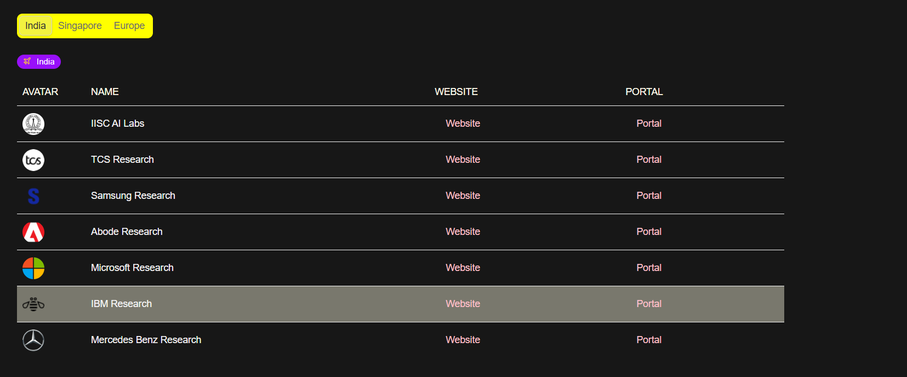

# Research Carrer
Sveltekit framework based basic project which displays companies that offer research carrer oppurtunities

## Dependencies
- Sveltekit (Frontend Meta Framework)
- Svelte (Frontend language)
- Tailwind CSS (CSS Utility Framework)
- Shadcn UI (Bits UI wrappers)
- Cobe (Earth focused 3.js wrapper)
- Lucide (SVG Icon Library)
- Vite (Build Tool)
- Bun (JavaScript Runtime, Bundler, Package Manager, CLI)
- Cloudflare Pages (Future Hosting)

## Screenshots
- Initial Landing Section

- Actual Content Section



## Installation
Very Easy Installations
- Firstly, clone the repository
- Secondly, install dependencies
- Thirdly, run dev server

```sh
# Firstly
git clone https://github.com/17anirudh/research-carrer.git
```
```sh
# Secondly
bun install
```
```sh
# Thirdly
bun run dev
```

## Building
To create a production version of your app:
```sh
bun run build
```

You can preview the production build with 
```sh
bun run preview
```
